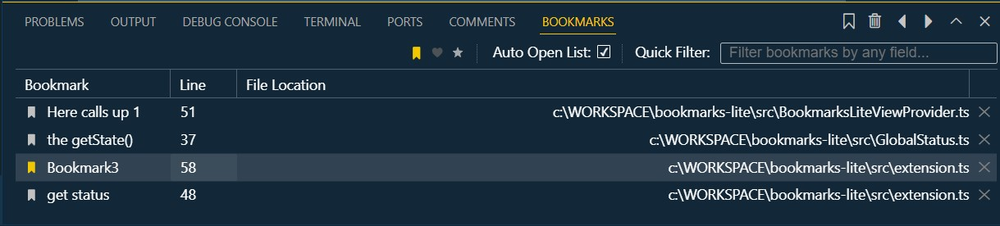
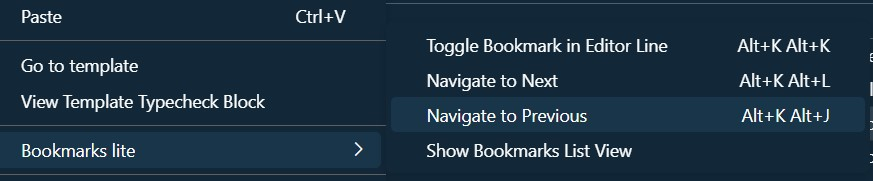

# BOOKMARKS-LITE

This is a **Visual Studio Code** extension for **creating and managing bookmarks** in the easiest way. It is **inspired by the visual studio bookmarks list**.

## Features

- **Editable bookmarks list** (will appear in a panel Visual Studio style but can be dragged to the sidebar).
  
  
- **Quick filter**.
- You can choose between **different icons** (you can use a heart :D)
- **keyboard shortcuts**

## Usage

- **Alt+k+k** (by default) to create a bookmark at the line selected by the cursor.
- **Alt+l+l** / **Alt+j+j** (by default) to go to next/previous bookmark.
- **Doble click on list** to navigate, **Supr**. to delete (or just use the buttons).
- Single click on the name to edit.
- **Context menu** over the line / left gutter.
  
  

## Why

As a software developer i love to use bookmarks to jump between the code files I'm working on at any given moment without having to remember anything. **I wanted to make a version with a more customized interface** and **more similar to the experience I have when using Visual Studio**. 

I also wanted to learn how to make VSCode extensions :D.

## Who
Hi, my Name is Diego Pérez-Fadón Gutiérrez, i'm a software developer living in Spain. I hope you're doing fine and thank you for reading this :).

## Contribute & Roadmap

If you have any suggestions or find any bug, please create an issue in the GitHub repository. I have many ideas to improve this extension but first we have to fix any bugs that may emerge.

## License

BOOKMARKS-LITE is under **[GNU GPLv3](https://choosealicense.com/licenses/gpl-3.0/)**.
(you can do almost anything you want with this project, except distributing closed source versions). 

It uses 
**[ag-grid-community](https://www.npmjs.com/package/ag-grid-community) ([MIT license](https://github.com/ag-grid/ag-grid/blob/HEAD/LICENSE.txt))**
and
**[umbrellajs](https://umbrellajs.com/) ([MIT License](https://github.com/franciscop/umbrella/blob/master/LICENSE))**

--
